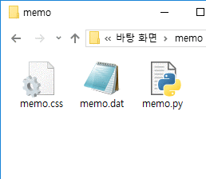
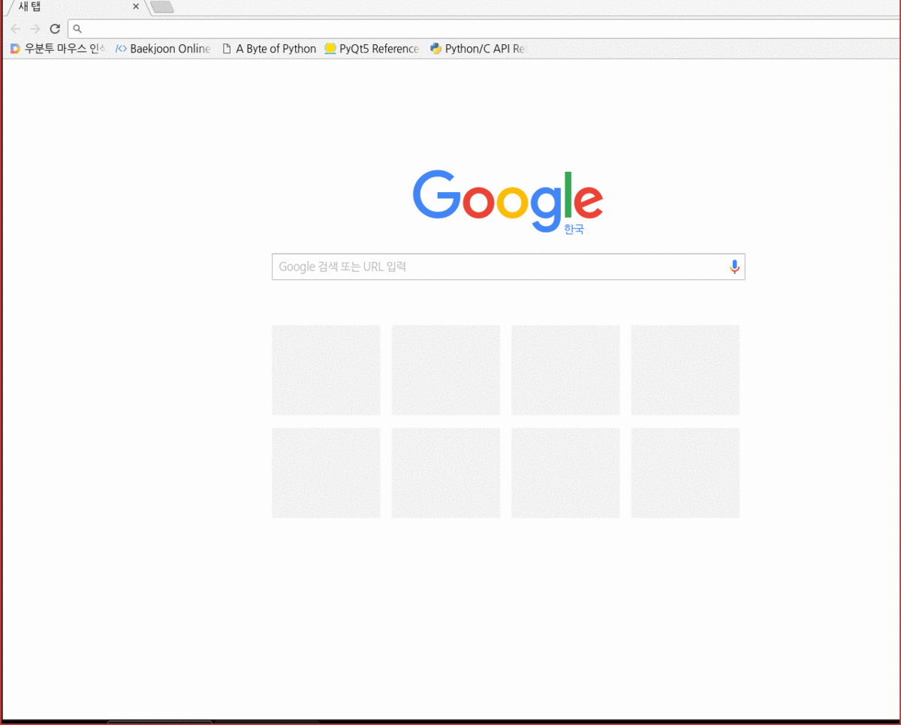
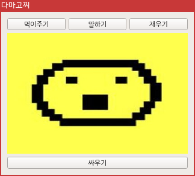
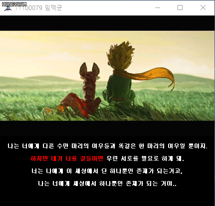

# 반갑습니다!
저는 취업준비생 임덕균입니다. 이 페이지는 제가 만들어보거나 시도해봤던 **가시적인** 응용 프로그램들을 소개합니다.

## C
#### GakView based on GTK3
<br>
간단하고 빠른 크로스 플랫폼 이미지 뷰어입니다.  

제작기간 : 2주

<a href="https://github.com/Gakgu/GakView/tree/7b5ea9bdee1cd0f2e6c89a8559acdeb44c163575">소스보기</a>

## C++
#### GakView based on SDL2
<br>
c언어와 GTK3 라이브러리 기반으로 만들었던 뷰어에 한계를 느끼고 새로 만든 뷰어입니다.  
이전보다 더 low-level에서 작동하기 때문에 더 빠르며 시스템 친화적입니다.  
게다가 코드가 C++로 구조적으로 짜여있어 유지 보수하기 쉽습니다.  

제작기간 : 2일

<a href="https://github.com/Gakgu/GakView.git">소스보기</a>

## Python
최근들어서 재미들린 언어입니다.
생산성이 좋아 가벼운 마음으로 쓸 수 있어 좋습니다.

#### 메모
<br>
개인적으로 사용할라고 만든 메모 프로그램입니다.  
다음 3가지 부분으로 이루어져 있습니다.  
```
memo.py  - 파이썬으로 작성된 실행 부분  
memo.dat - 텍스트를 저장하는 파일  
memo.css - 메모의 모양을 설정하는 스타일시트 파일  
```

제작기간 : 2시간  

<a href="https://gist.github.com/Gakgu/268384e67241b2ddd8b0c42ea4949797">소스보기</a>

#### 바탕화면 부수기
<br>
어린 시절 재미있게 했던 바탕화면 부수기입니다.

제작기간 : 1시간

<a href="https://gist.github.com/Gakgu/4ed041dad46631483d6147d39ede9227">소스보기</a>

## Etc
<br>
Qt를 처음 접할 때 만들어본 것들입니다. 이 중 어린왕자는 C++로 제작되었습니다.
