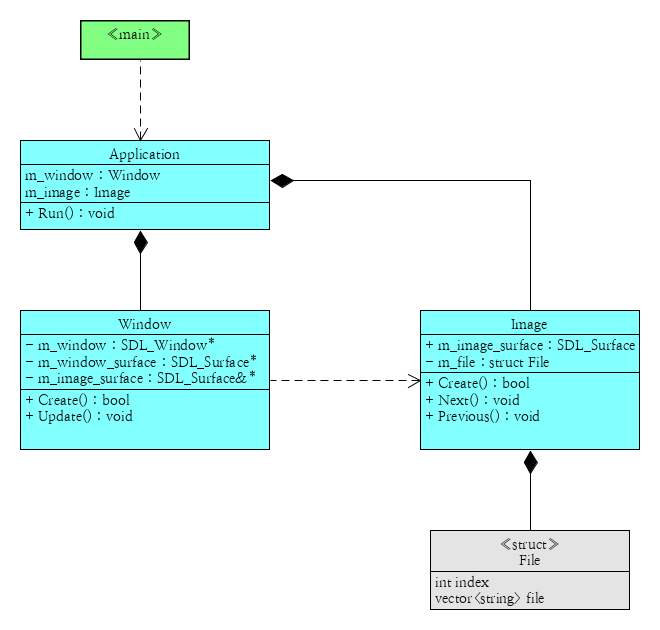
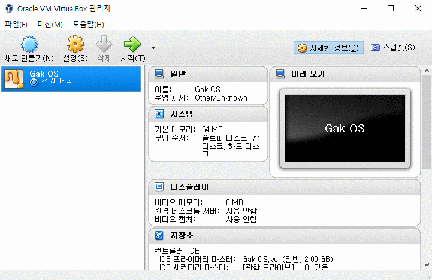

# 반갑습니다!
이 페이지는 제가 만들어보거나 시도해봤던 **가시적인** 응용 프로그램들을 소개합니다.  
나열된 **모든 응용 프로그램들**은 Windows와 Linux에서 작동하는 크로스 플랫폼입니다.

***

# 목록

1. C  
  1.1. GakView based on GTK3  
2. C++  
  2.1. GakView based on SDL2  
3. Python  
  3.1. memo  
  3.2. screen breaker  
4. Assambly  
  4.1. Gak OS bootloader  
5. Java  
  5.1. Unity Games
6. Etc  
  6.1. Fire Detector
  6.2. tamagotchi & young prince

# 1. C
### 1.1. GakView based on GTK3
 
**설명**  
크로스 플랫폼 이미지 뷰어입니다.  
작고 빠르며 여러 플랫폼에서 동일하게 작동하는 이미지 뷰어를 목표로 한 프로그램입니다.

**제작기간** : 2주

<a href="https://github.com/Gakgu/GakView/tree/7b5ea9bdee1cd0f2e6c89a8559acdeb44c163575">소스보기</a>

***

# 2. C++
### 2.1. GakView based on SDL2
 
**설명**  
이 전에 만들었던 뷰어에 태생적 한계를 느끼고 새로 만든 뷰어입니다.  

**달라진점**  

- **네이티브 시스템적입니다!**  
이 전의 GTK3은 리눅스 라이브러리 윈도우에서 실핼할 때 이질적인 느낌이 있었습니다.
- **빨라졌습니다!**  
전보다 Low-level에서 작성되었기 때문에 성능이 향상되었습니다.
- **가벼워 졌습니다!**  
의존적인 라이브러리 자체의 크기가 줄어들었기 때문에 용량을 더 적게 차지합니다.
- **유지보수가 간편합니다!**  
구조적으로 재설계되었기 때문입니다.

**제작기간** : 2일

<a href="https://github.com/Gakgu/GakView.git">소스보기</a>

***

# 3. Python
최근들어서 재미들린 언어입니다.
생산성이 좋아 가벼운 마음으로 쓸 수 있어 좋습니다.

## 3.1. 메모
 
**설명**  
개인적으로 사용할라고 만든 메모 프로그램입니다.  

**주요 기능**

- **자동 저장**  
프로그램을 끄면 자동으로 memo.dat에 메모를 저장합니다.  
- **스타일 시트**  
memo.css의 스타일 시트를 사용하여 메모의 모습을 꾸밀 수 있습니다.  

**제작기간** : 2시간  

<a href="https://gist.github.com/Gakgu/268384e67241b2ddd8b0c42ea4949797">소스보기</a>

## 3.2. 바탕화면 부수기
 
**설명**  
어린 시절 재미있게 했던 바탕화면 부수기입니다.  
프로그램을 시작하면 화면이 정지하고 그 상태에서 클릭하면 화면이 깨집니다.

**제작기간** : 1시간

<a href="https://gist.github.com/Gakgu/4ed041dad46631483d6147d39ede9227">소스보기</a>

***

# 4. Assambly
## 4.1. Gak OS bootloader
 
**설명**  
개인 OS를 가지고 싶어서 만든 부트로더입니다.  
아직 실력이 부족해 부트로더까지밖에 못만들었지만 포기한 프로젝트는 아닙니다.  
저에게 low-level에 대한 이해도를 많이 상승시켜준 프로젝트입니다.

**제작기간**  
nasm문법과 하드웨어 공부를 병행하며 만들었기 때문에 제작기간이
얼마나 걸렸다. 라고 말하기 어렵습니다.

<a href="https://gist.github.com/Gakgu/3a38e3f6175a6c317598f67c880aed20">소스보기</a>

***
# 5. Java
## 5.1. Unity Games

 

 
**소개**  
유니티로 만든 5가지 게임입니다.  
각각 건담, 물고기, 미로, 좀비, 슈팅 게임입니다.

**제작기간** : 각각 1~7일

***

# 6. Etc
## 6.1. Fire Detector
 
**설명**  
센서에서 화재를 감지하면 알림을 띄워주는 어플리케이션입니다.  
tcp/ip로 연결했기 때문에 거리에 제한이 없습니다.  
팀 프로젝트로 만든 졸업작품입니다.  

**맡은 역할**  
- 아두이노와 중앙서버, 중앙서버와 어플리케이션의 연결을 담당했습니다.
- 구글의 Firebase Cloud Messagin기능을 이용하여 팝업창을 띄우는 것을 만들었습니다.
- ndk를 이용하여 자바로 만들어진 어플에 c언어로 만들어진 서버를 이식했습니다.
- 솔직히 UI 빼고 제가 다 만들었습니다..

**제작기간**  
주어진 시간은 1년이었지만 실질적으로 만든 것은 2주 안팎이었습니다.

## 6.2. tamagotchi & young prince
 
**설명**  
Qt를 처음 접할 때 만들어본 것들입니다.  
- tamagotchi   : Python으로 qt를 처음 다뤄본 프로그램입니다.
- young prince : C++로 Qt를 처음 다뤄본 프로그램입니다.

**제작기간** : 1~3시간
